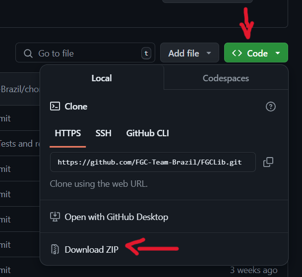

# First Global Challenge Java Library
The First Global Challenge Java Library (FGCLib) is a Java code library,
that uses the standard First Tech Challenge (FTC) SDK as its code base, while adding many new features and a new
new features and a new code structure.

This library was developed and is maintained by the FGC Team Brazil. The aim of the library is to facilitate
the creation of code for FGC teams, using an organized, flexible and easily understandable structure.
Among the library's features are:
- **SDK FTC**: FGCLib uses the structure provided by first as the code base, i.e. the SDK used by the
  FTC is included in the lib by default;
- **Dynamic Structure**: FGCLib's code structure is robust and intuitive, it has been designed to
  be easily implemented and its structure helps to keep the code more readable and organized;
- **Embedded PIDF**: The library also has an integrated PIDF controller,
  there is no need to create it manually;
- **FTCDashboard**: Lib also has support for the use of FTCDashboard (currently it is not
  currently in use, but if your team wants to use it, just follow the tutorial
[Migrating to FTCDashboard](doc/en/Migrating%20to%20FTCDashboard.md))
- **DrivetrainBuilder**: FGCLib has a helper class that automates the creation of
  a drivetrain tank.

FGCLib has complete documentation on how to use it. In the README, you can find our
written documentation, as well as explanatory videos with step-by-step guides on how to use the library.

# Table of Contents
- [First Global Challenge Java Library](#first-global-challenge-java-library)
- [Installation](#installation)
  - [Download Code .zip](#downloading-zip)
  - [Cloning Repository](#cloning-the-repository)
- [Documentation](#documentation)
- [Contribution](#contribution)
- [Contact](#contact)

# Installation
## Downloading ZIP
On the repository home page, click on the Code button, then click on Download ZIP to download the
.zip file. 

After installation, simply extract the code from the file and open it in an IDE of your choice.

## Cloning the Repository
Create a folder that will store the code. Then open the folder in your terminal and run the command:

    git clone https://github.com/FGC-Team-Brazil/FGCLib.git

Once the command is complete, the library code will already be on your computer. All you have to do is open it
in your IDE.

# Documentation
All the library's features are documented in this repository. Access the documentation via
the link below:

[Documentation First Global Challenge Java Library](doc/en/1%20-%20Introduction%20to%20FGCLib.md)
- [Introduction to FGCLib](doc/en/1%20-%20Introduction%20to%20FGCLib.md)
- [Creating a subsystem](doc/en/2%20-%20Creating%20a%20Subsystem.md)
- [Using the DrivetrainBuilder](doc/en/3%20-%20Using%20the%20DrivetrainBuilder.md)
- [PIDF Controller](doc/en/5%20-%20Using%20the%20PIDF%20Controller.md)
- [Using the SmartGamePad](doc/en/4%20-%20Utility%20Class%20SmartGamePad.md)

# Contribution
Contribute to the evolution of the project!
You can help the library grow through pull requests or github issues. What's more,
if you feel the need, you can contact us through our [Social Networks](#contact).

# Contact
For any questions or further information, please contact our [email](mailto:fgc.team.br@gmail.com).