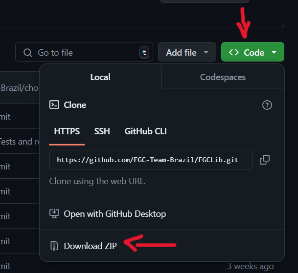

# First Global Challenge Java Library
A First Global Challenge Java Library(FGCLib) é uma biblioteca de código Java,
que usa o SDK padrão da First Tech Chanllenge (FTC) como base do código, ao mesmo tempo que adiciona muitas
funcionalidades novas e uma nova estrutura de código.

Essa biblioteca foi desenvolvida e é mantida pelo FGC Team Brazil. O objetivo da biblioteca é facilitar
a criação do código das equipes FGC, usando uma estrutura organizada, flexível e facilmente entendível.
Dentre as funcionalidades da biblioteca estão:
- **SDK FTC**: A FGCLib usa a estrutura provida pela first como base do código, ou seja, o SDK usado
  pela FTC é inluído por padrão na lib;
- **Estrutura Dinâmica**: A estrutura de código da FGCLib é robusta e intuitiva, foi projetada para
  ser facilmente implementada e sua estrutura ajuda a manter o código mais legível e organizado;
- **PIDF Imbutido**: A biblioteca também conta com um controlador PIDF integrado,
  não sendo necessário sua criação manual;
- **FTCDashboard**: A Lib também conta com suporte para o usa da FTCDashboard (atualmente ela não
  está em uso, mas caso sua equipe queira usar, basta seguir o tutorial
[Migrating to FTCDashboard](Migrando%20para%20a%20FTCDashboard.md))
- **DrivetrainBuilder**: A FGCLib conta com uma classe auxiliar que automatiza a criação de
  um tank drivetrain.

A FGCLib conta com uma documentação completa de seu uso. No README, você poderá achar as nossas
documentações escritas, bem como vídeos explicativos com guias passo a passo de como usar a biblioteca.

# Tabela de Conteúdos
- [First Global Challenge Java Library](#first-global-challenge-java-library)
- [Installation](#instalação)
    - [Download Code .zip](#baixando-o-zip)
    - [Cloning Repository](#clonando-o-repositório)
- [Documentation](#documentação)
- [Contribution](#contribuição)
- [Contact](#contato)

# Instalação
## Baixando o ZIP
Na página inicial do repositório, clique no botão código, depois clique em Baixar ZIP para baixar o arquivo
.zip do código.

Após a instalação, basta extrair o código do arquivo e abrí-lo em um IDE de sua escolha.

## Clonando o Repositório
Crie uma pasta que irá armazenar o código. Após isso, abra a pasta em seu terminal e rode o comando:

    git clone https://github.com/FGC-Team-Brazil/FGCLib.git

Após a finalização do comando, o código da biblioteca já estará no seu computador. Ademais, basta abrir-lo
em seu IDE.

# Documentação
Todas as funcionalidades da biblioteca estão documentadas neste repositório. Acesse as documentações através
do link abaixo:

[Documentação First Global Challenge Java Library](doc/en/Introduction%20to%20FGCLib.md)
- [Introdução À FGCLib](Introdução%20à%20FGCLib.md)
- [Criando um subsistema](Criando%20um%20Subsistema.md)
- [Usando o DrivetrainBuilder](Usando%20o%20DrivetrainBuilder.md)
- [Controlador PIDF](Usando%20o%20Controlador%20PIDF.md)
- [Usando o SmartGamePad](Classe%20utilitária%20SmartGamePad.md)

# Contribuição
Contribua para a evolução do projeto!
Você pode ajudar no crescimento da biblioteca através de pull requests ou issues do github. Além do mais,
caso ache preciso, pode entrar em contato conosco através das nossas [Redes Sociais](#contact).

# Contato
Para quaisquer questões, dúvidas ou informações adicionais, nos contato através de nosso [email](mailto:fgc.team.br@gmail.com).
